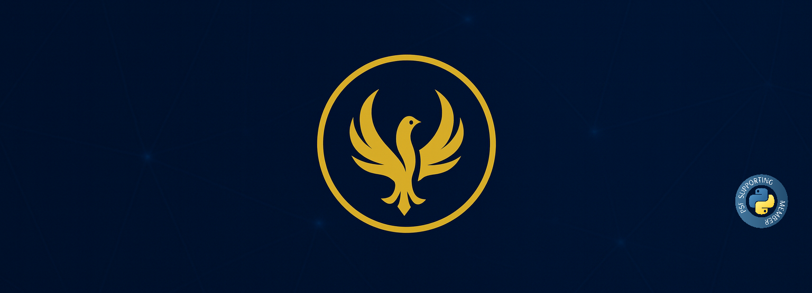

<!-- Banner -->

  

<em> </em>

# L. Elaine Dazzio

*TPM | AI/ML Engineer | Phoenix 🐦‍🔥 | Active Top Secret Clearance*

---
🔍 About Me

Technical Program Manager with 17+ years leading complex, multi-disciplinary programs in U.S. Air Force
acquisitions. Google Cloud Professional Machine Learning Engineer (2025-2027) with proven expertise
delivering cross-functional programs from strategy through execution. Track record managing
multi-billion-dollar initiatives, aligning stakeholders across engineering, product, policy, and executive
leadership to drive measurable business outcomes. Active Top Secret Clearance. Open to relocation or
remote collaboration.

---

### 📫 Connect
- 📰 [Substack: Tales of the Phoenix](https://talesofthephoenix.substack.com/)  
- 💼 [LinkedIn](https://www.linkedin.com/in/l-elaine-dazzio-030945385)  
- ☕ [Buy Me a Coffee](https://www.buymeacoffee.com/ledazzio)

---

  © 2025 L. Elaine Dazzio · All rights reserved.

